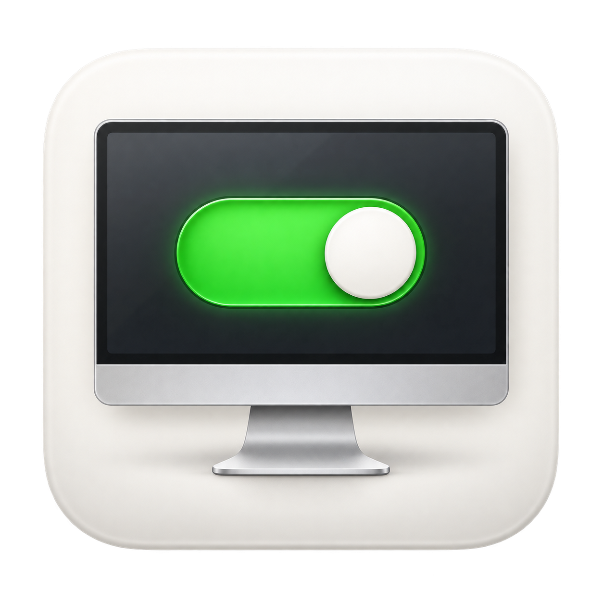
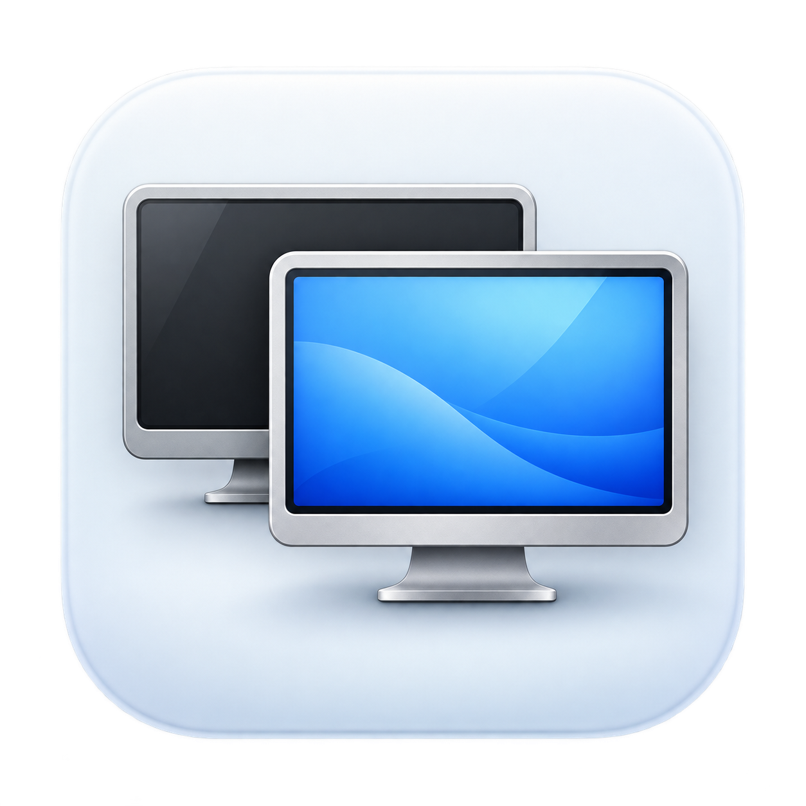
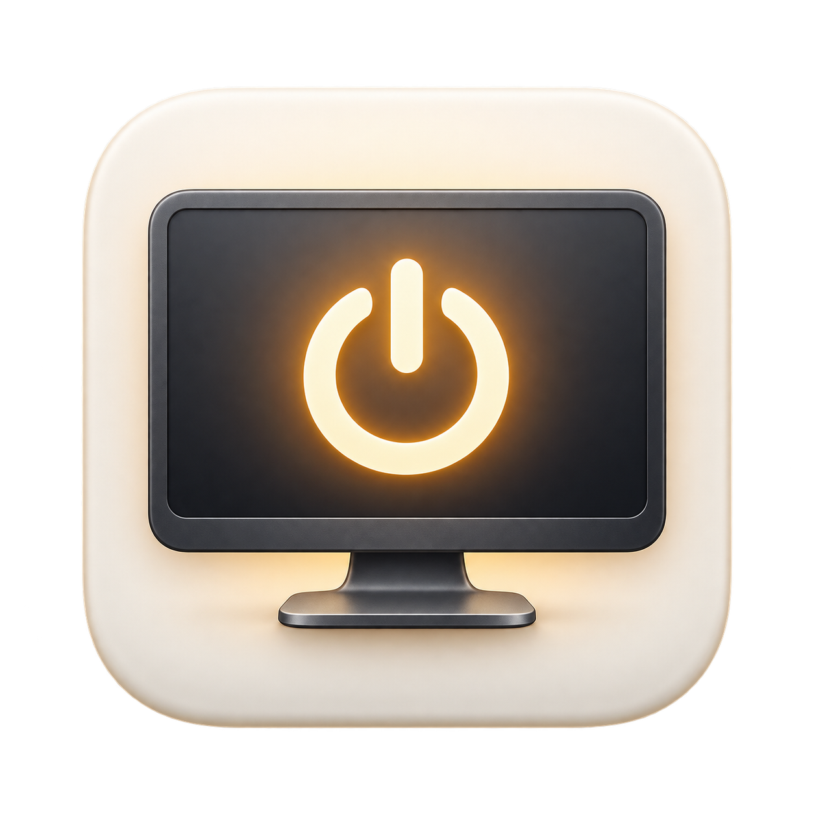

# App icon concepts

Generated with the built-in image generation tool. The tool does not expose a model selector, so GPT Image 2.5 could not be requested or verified. **Option 3 was selected** for the app. Its source is saved as [`assets/AppIcon.png`](../../assets/AppIcon.png); `scripts/build-icon.sh` produces the bundled ICNS resource.

| 1 · Display switch | 2 · Two displays | 3 · Display power |
| --- | --- | --- |
|  |  |  |

## Prompts

### 01-display-switch

Use case: logo-brand. Asset type: macOS application icon for DisplayToggle, a tiny native menu-bar utility that disconnects and reconnects external computer monitors. Create a single refined production-quality icon concept, square 1024x1024. One centered icon, generous consistent small margin, genuinely transparent outside a softly rounded-square macOS tile. Subtle dimensional materials and restrained soft shadows, bold silhouette readable at 32px. No text, lettering, Apple logo, watermark, presentation layout, or extra objects. Concept: a minimal front-facing silver desktop monitor, the monitor screen itself contains one large tactile horizontal on/off toggle switch. The switch clearly enabled, luminous clean green track with an off-white circular thumb. Elegant satin off-white tile, dark graphite monitor screen and slender silver foot. Crisp geometry, playful precision, restrained depth, premium native utility aesthetic.

### 02-two-displays

Use case: logo-brand. Asset type: macOS application icon for DisplayToggle, a tiny native menu-bar utility that disconnects and reconnects external computer monitors. Create a single refined production-quality icon concept, square 1024x1024. One centered icon, generous consistent small margin, genuinely transparent outside a softly rounded-square macOS tile. Subtle dimensional materials and restrained soft shadows, bold silhouette readable at 32px. No text, lettering, Apple logo, watermark, presentation layout, or extra objects. Concept: two slightly overlapping simplified desktop monitors, one behind unlit dark graphite and one in front glowing a calm clear blue. An immediately legible pair of display silhouettes with short centered feet, no arrows or switch glyphs. Cool porcelain tile, satin silver frames, luminous front screen with very subtle tonal depth. Sophisticated understated macOS utility icon, beautifully balanced geometry.

### 03-display-power

Use case: logo-brand. Asset type: macOS application icon for DisplayToggle, a tiny native menu-bar utility that disconnects and reconnects external computer monitors. Create a single refined production-quality icon concept, square 1024x1024. One centered icon, generous consistent small margin, genuinely transparent outside a softly rounded-square macOS tile. Subtle dimensional materials and restrained soft shadows, bold silhouette readable at 32px. No text, lettering, Apple logo, watermark, presentation layout, or extra objects. Concept: one bold simplified desktop display silhouette in satin graphite with a single large pale luminous power symbol centered on the screen. Warm off-white softly sculpted tile, a subtle warm amber halo behind the power symbol, simple slender stand. Graphic restraint, precise geometry, gentle premium material depth, strong contrast and exceptional small-size legibility.
